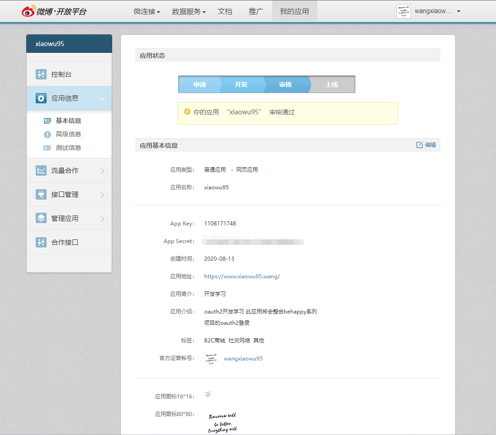
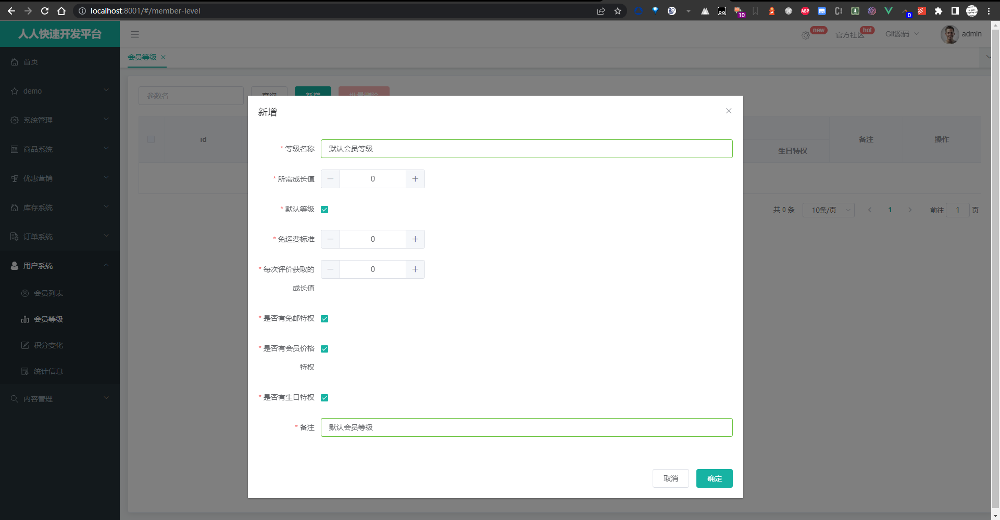

# 注：

> 请完整并详细的阅读每个项目的README！！！

# 主要技术栈

alibaba,cloud,springboot,最佳实践版本：https://github.com/alibaba/spring-cloud-alibaba/wiki/%E7%89%88%E6%9C%AC%E8%AF%B4%E6%98%8E

**核心依赖**

renren-fast使用的是1.8，改17较为麻烦，所以未整合到gulimall中

> Jdk: 17.x/1.8
>
> Maven: 3.8.7
>
> Nodejs: 12.x


| 依赖                 | 版本                                                    |
| -------------------- | ------------------------------------------------------- |
| Spring Boot          | 3.1.1                                                   |
| Spring Cloud         | 2022.0.3                                                |
| Spring Cloud Alibaba | 2022.0.0.0-RC2                                          |
| Mybatis Plus         | 3.5.3.1                                                 |
| Spring Doc Open Api  | 2.0.2                                                   |
| Behappy-Redis        | 3.1.2(https://github.com/behappy-project/behappy-redis) |
| Wxpay-Sdk            | 0.0.3                                                   |
| Hutool               | 5.8.20                                                  |
| ......               | ......                                                  |

# TODO

- [x] 微信支付
- [x] 微信oauth2登录
- [x] JDK17/SB3.x升级
- [ ] K8S部署
- [ ] graalvm云原生镜像构建
- [ ] 链路日志（sleuth已不再兼容sb3.x，见[链接](https://docs.spring.io/spring-cloud-sleuth/docs/current-SNAPSHOT/reference/html/)，之后考虑自己实现）

# 环境搭建

首先我们需要一个能安装docker的环境，这里使用vagrant+virtualBox

vagrant下载地址：https://developer.hashicorp.com/vagrant/downloads

virtualBox下载地址：https://www.virtualbox.org/wiki/Downloads

## 将vagrant加入到系统环境变量中


## 初始化Vagrantfile

- 以管理员身份执行CMD，切到vagrant安装目录的bin路径下
- 执行`vagrant init`，它会帮我生成`Vagrantfile`，如下

> D:\HashiCorp\Vagrant\bin>vagrant init


## 修改Vagrantfile并执行创建虚拟机命令

- 我们需要centos7版本的box，这里提供两种办法
    - 一种是直接在`vagrant up`的时候让服务自己去下载(此种办法可能会由于网络问题下载失败)
    - 或者通过此地址`https://app.vagrantup.com/centos/boxes/7/versions/2004.01/providers/virtualbox.box`，将box下载到本地，然后执行`vagrant box add --name centos/7 D:\HashiCorp\Vagrant\boxes\CentOS-7-x86_64-Vagrant-2004_01.VirtualBox.box`，再使用`vagrant box list`查看box列表是否存在，已存在则说明成功
- 修改Vagrantfile

```yaml
Vagrant.configure("2") do |config|
   (1..1).each do |i|
        config.vm.define "behappy#{i}" do |node|
            # 设置虚拟机的Box
            node.vm.box = "centos/7"
            # 设置虚拟机的主机名
            node.vm.hostname="behappy#{i}"
            # 设置虚拟机的IP，这里最终得到虚拟机的ip为192.168.56.100
            node.vm.network "private_network", ip: "192.168.56.#{99+i}", netmask: "255.255.255.0"
            # VirtaulBox相关配置
            node.vm.provider "virtualbox" do |v|
                # 设置虚拟机的名称
                v.name = "behappy#{i}"
                # 设置虚拟机的内存大小
                v.memory = 8192
                # 设置虚拟机的CPU个数
                v.cpus = 4
            end
        end
   end
end
```

- 启动虚拟机

执行`vagrant up`，等待启动完成

## 配置虚拟机ssh(远程登录)、网络、防火墙以及时间同步

- 执行`vagrant ssh`进入虚拟机
- 执行`sudo -s`切至root并修改ssh

```bash
vi /etc/ssh/sshd_config

修改以下属性为yes
PermitRootLogin yes 
PasswordAuthentication yes
```

- 修改完成后`:wq`保存，然后执行`service sshd restart`，重启ssh
- 最后执行`reboot`重启（我这里换成xshell登录，账户密码:root@vagrant）

* 关闭防火墙

```shell
systemctl stop firewalld
systemctl disable firewalld
```

* 关闭seLinux

```sh
# linux默认的安全策略
sed -i 's/enforcing/disabled/' /etc/selinux/config
setenforce 0
```

* 关闭swap

```shell
swapoff -a #临时关闭
sed -ri 's/.*swap.*/#&/' /etc/fstab #永久关闭
free -g #验证，swap必须为0
```

- **[centos 安装 ntpdate 并同步时间](https://www.cnblogs.com/xxoome/p/6125630.html)**

安装ntp

```
yum install -y ntp
```

与一个已知的时间服务器同步

```
# time.nist.gov 是一个时间服务器
ntpdate time.nist.gov 
```

删除本地时间并设置时区为上海

```
rm -rf /etc/localtime
ln -s /usr/share/zoneinfo/Asia/Shanghai /etc/localtime
```

## 安装git、docker、docker-compose并配置自启

```bash
yum install -y git
curl -fsSL https://get.docker.com | bash -s docker --mirror Aliyun
systemctl enable docker
systemctl start docker
curl -L https://github.com/docker/compose/releases/download/v2.16.0/docker-compose-linux-x86_64 -o /usr/local/bin/docker-compose && chmod +x /usr/local/bin/docker-compose
```

# 组件配置安装

- clone `behappy-docker-application` 项目

```bash
cd ~ && git clone https://github.com/behappy-project/behappy-docker-application.git
```

- 注：
  - 仓库内所有指定的地址均为192.168.56.100，可自行修改
  - sentinel/docker-compose.yml需自行将环境变量注释部分打开

- 先创建mysql，并初始化一些表结构和数据

```bash
cd behappy-docker-application/ && docker-compose -f mysql/docker-compose.yml up -d

创建好mysql后，执行resources下的sql文件： db/*.sql-》nacos初始化表结构.sql-》nacos初始化数据.sql-》seata/mysql.sql
```

- 启动其他组件

```bash
docker-compose -f redis/docker-compose.yml up -d && docker-compose -f rabbitmq/docker-compose.yaml up -d && docker-compose -f nacos/docker-compose.yml up -d && docker-compose -f sentinel/docker-compose.yml up -d && docker-compose -f seata/docker-compose.yml up -d
```

# Nacos配置

> 共享配置信息被我放在了`application-dev.yml`中，可以自行查看且修改


# Sentinel配置

> 可自行配置
>
> sentinel-nacos集成版源码地址：https://github.com/behappy-project/behappy-sentinel-dashboard


注：gateway中，每一个RouteDefinition都有id唯一标识，格式为ReactiveCompositeDiscoveryClient_{微服务名}，所以routeId配置成{微服务名}是不生效的

关于sentinel的详细教程可以参考：https://wang-xiaowu.github.io/posts/c7b26cd1/

# Seata配置 (数据我已配置完，见nacos)


> seata/分布式事务学习可见blog：https://wang-xiaowu.github.io/posts/4a100baa/ , https://wang-xiaowu.github.io/posts/cdcc4eae/

## docker-compose方式启动seata-ha
- `docker-compose -f seata/docker-compose.yml up -d`
- 查看是否成功


# 服务配置+启动

### Nginx

- Docker版本：谷粒商城-Nginx(静态资源代理以及服务反代)： https://github.com/behappy-gulimall/behappy-gulimall-nginx

- Windows版：谷粒商城-Nginx(静态资源代理以及服务反代)： https://github.com/behappy-gulimall/behappy-gulimall-nginx-windows

### 后端项目

- 谷粒商城-后台管理-后端(renren-fast)： https://github.com/behappy-gulimall/behappy-gulimall-fast
- 谷粒商城SpringBoot3.x： https://github.com/behappy-gulimall/behappy-gulimall

### 前端项目

- 谷粒商城-后台管理-前端(renren-fast-vue)： https://github.com/behappy-gulimall/behappy-gulimall-vue

> npm install && npm run start

# 系统流程

> 具体的流程不再赘述，这里主要补充下老师原版课程中未涉及到的

### 配置HOST

```bash
# ip指向你的服务运行所在机器
127.0.0.1 gulimall.com
127.0.0.1 search.gulimall.com
127.0.0.1 item.gulimall.com
127.0.0.1 auth.gulimall.com
127.0.0.1 cart.gulimall.com
127.0.0.1 order.gulimall.com
127.0.0.1 member.gulimall.com
127.0.0.1 seckill.gulimall.com
```

### 配置内网穿透

> 使用ngrok可以参考：https://www.xiaowu95.wang/posts/c43c5d8d/

### 微博（可选，可用微信登录）

#### 注册开发账户



#### 修改登录指向地址

> 修改`behappy-auth-server\src\main\resources\templates\login.html`中的`https://api.weibo.com/oauth2/authorize?client_id=1108171748&response_type=code&redirect_uri=http%3A%2F%2Fauth.gulimall.com%2Foauth2.0%2Fweibo%2Fsuccess`，将client_id修改为你的

### 后台操作

> 在上面执行sql的过程中，我已准备好商品数据，你可以自行选择导入（oss图片我已关了公共读权限，请自行更改）
>
> 或者自行进行`手动上架`以及`配置库存`操作。当然，这两个操作不冲突，但也可二选一

#### 创建es索引

> 执行`behappy-search\src\main\resources\new_product_mapping.json`

#### 手动上架数据库商品数据

> 执行测试类：`BehappyProductApplicationTests.upProductToEs`

#### 创建库存


#### 创建会员默认等级



#### 配置会员地址


### 微信登录

> appid及secret使用的是谷粒学院课程中提供的，在此感谢
>
> 微信回调后，我们再重定向到auth.gulimall.com下，保证session共享在同一个顶级域名下。所以定义/callback和/recallback两个接口进行接口转发


### 微信支付

> 每个商品的定价已设置为1分，所以可放心测试
>
> 记得修改notify-url

# 各中间件服务地址一览

### Nacos控制台

地址：http://192.168.56.100:8848/nacos

账户：nacos

密码：nacos

### sentinel dashboard

地址：http://192.168.56.100:8858/

账户：sentinel

密码：sentinel

### spring doc地址

地址：http://localhost:88/swagger-ui.html

### rabbitMQ manager

地址：http://192.168.56.100:15672/

账户：root

密码：root

# 模块

```tree
├─behappy-api  - 放置vo/to/dto/feign
│  ├─behappy-api-auth
│  ├─behappy-api-cart
│  ├─behappy-api-common
│  ├─behappy-api-coupon
│  ├─behappy-api-member
│  ├─behappy-api-order
│  ├─behappy-api-product
│  ├─behappy-api-search
│  ├─behappy-api-seckill
│  ├─behappy-api-thirdparty
│  └─behappy-api-ware
├─behappy-auth-server  - auth模块
├─behappy-cart  - 购物车模块
├─behappy-common  - 公共模块
│  ├─behappy-common-core
│  ├─behappy-common-es
│  ├─behappy-common-mybatis
│  ├─behappy-common-pay
│  ├─behappy-common-rmq
│  ├─behappy-common-seata
│  └─behappy-common-sentinel
├─behappy-coupon  - 优惠模块
├─behappy-gateway  - 服务网关
├─behappy-member  - 会员模块
├─behappy-order  - 订单模块
├─behappy-product  - 商品模块
├─behappy-search  - 搜索模块
├─behappy-seckill  - 秒杀模块
├─behappy-third-party  - 第三方模块
├─behappy-ware  - 库存模块
├─resources  - 笔记/文档/sql
```

